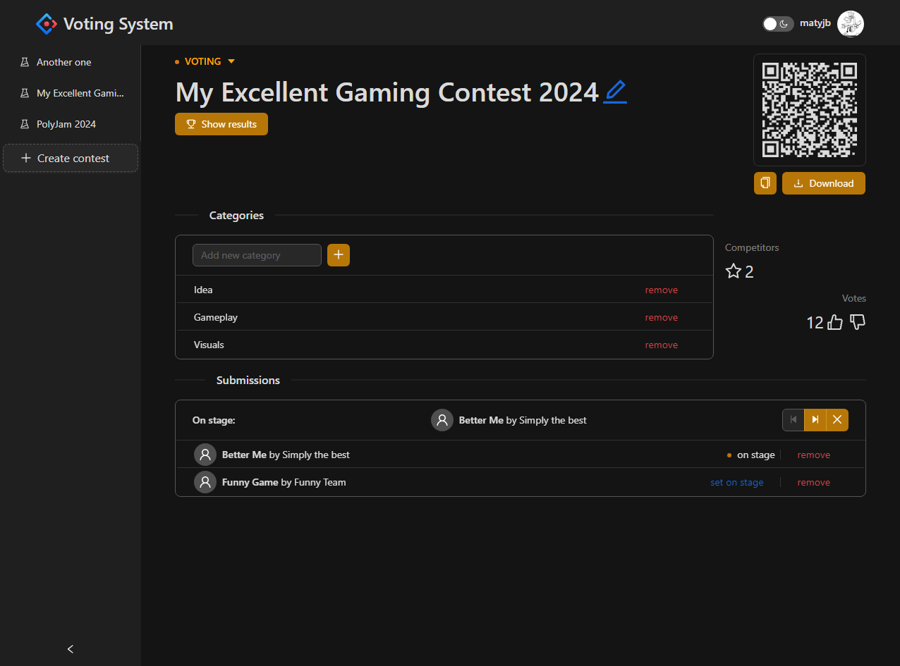
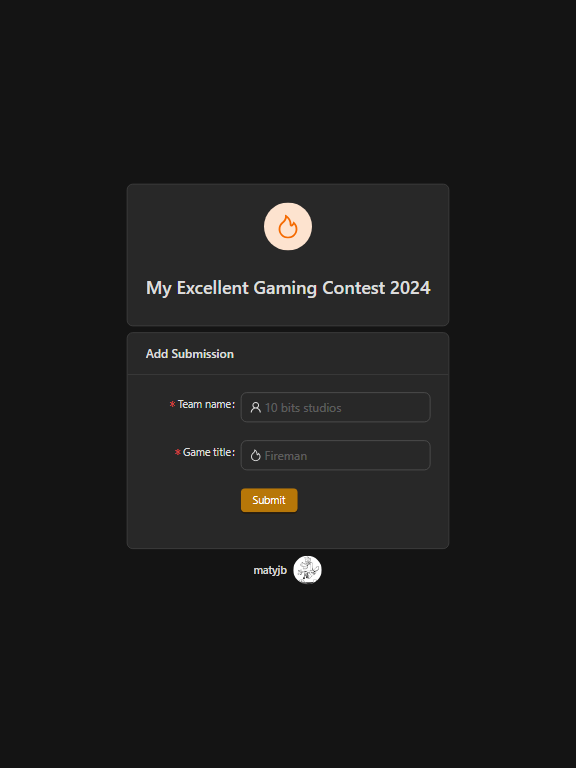
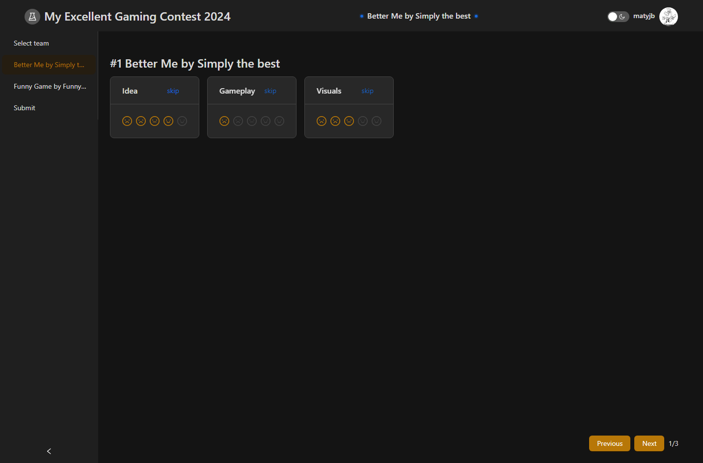
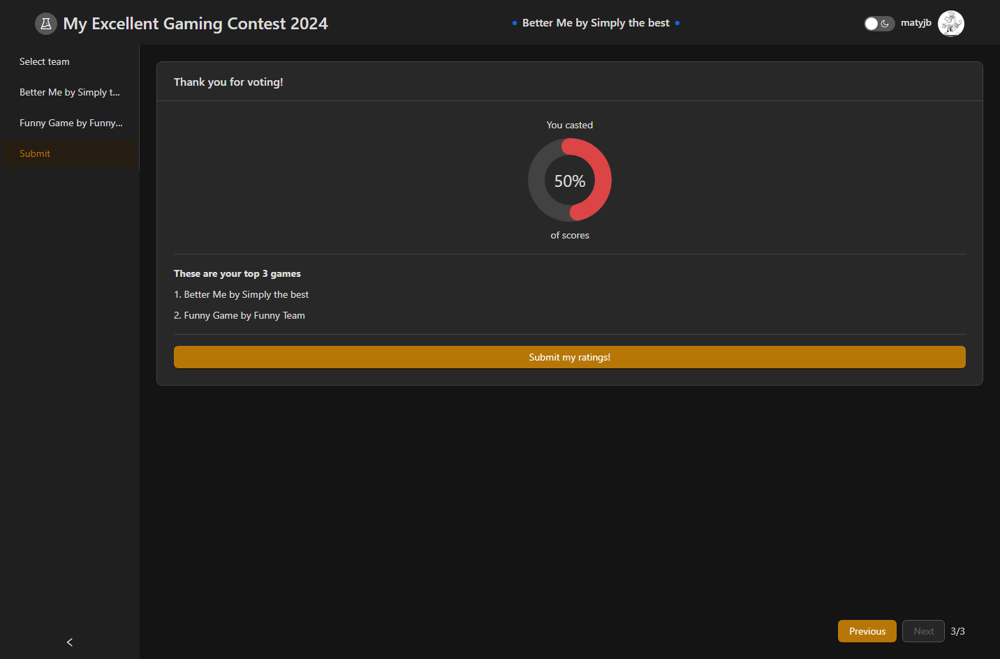

# Voting system [WIP]

This app provides functionality to create a contest and let users submit their work for scoring by the audience. As an admin of the contest you can manage submissions, create categories in which public will review and have control over the state of the contest (submission phase, closed phased, voting phase)

